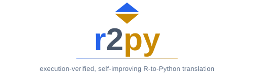
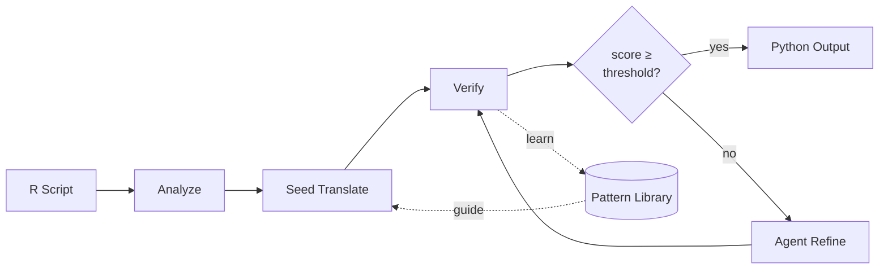

<p align="center">
  <picture>
    <source media="(prefers-color-scheme: dark)" srcset="assets/banner-dark.svg">
    
  </picture>
</p>

<p align="center">
  An agentic R-to-Python transpiler harness that learns from its own mistakes.
  <br><br>
  <a href="#quick-start">Quick Start</a> · <a href="#usage">Usage</a> · <a href="architecture.md">Architecture</a>
</p>

---

## What is r2py?

Most code translation tools are either rule-based (precise but incomplete) or LLM-based (flexible but unverified). r2py is a third approach: **translate, execute both versions, compare their behavior, and learn from the results.**

It translates R scripts to Python by combining LLM-powered code generation with execution-based verification. Both versions run in sandboxed environments, and the system compares their observable effects — printed output, data structures, plots, files, environment changes — to produce a decomposed score. A reasoning agent iteratively improves translations until they match.

The reward signal comes from running both scripts and comparing their observable effects side-by-side — if the Python version produces the same stdout, data frames, plots, and files as the R original, the translation is correct.

Verified patterns are extracted into a **Pattern Library** — a collection of Markdown files with evidence, confidence levels, and contradiction tracking. The library is reused on future translations, making the system self-improving without any model fine-tuning. Crucially, the Pattern Library closes the gap between frontier and local models: by front-loading verified R→Python knowledge into the prompt, smaller open-weight models like Gemma 4 can produce translations that would otherwise require a much larger model. Because learning is externalized rather than baked into weights, the same architecture could in principle be applied to other language pairs.

## How It Works



**Analyze** — Parses R via tree-sitter, executes the script and unevaluated branches, catalogs all entities and effects, and flags R-specific gotchas (1-based indexing, NA semantics, vector recycling, non-standard evaluation).

**Seed Translate** — An LLM translates the whole file in one call, guided by relevant Pattern Library entries. Multiple candidates are generated and the best is selected.

**Verify** — Runs both R and Python in sandboxed environments. Compares 10+ effect classes (stdout, data values, graphics, HTML, files, environment, warnings, RNG state) using typed comparators. Produces a per-entity, per-effect score.

**Agent Refine** — If the score is below threshold, a reasoning agent iteratively rewrites the translation. Each rewrite must strictly improve the score — ties are rejected.

**Pattern Library** — Verified improvements are extracted as reusable patterns with confidence levels (`confirmed`, `tentative`, `contradicted`). Contradicted patterns are hidden from future translations. The library is diffable, version-controllable, and fully human-readable.

## Quick Start

### Prerequisites

- Python 3.10+
- [R](https://cloud.r-project.org/) (>= 4.4)
- An [Anthropic API key](https://console.anthropic.com/) or a local [Ollama](https://ollama.ai/) instance

### Install

```bash
git clone https://github.com/yourusername/r2py.git
cd r2py
pip install -e .
```

### Set up the R environment

The verification engine runs R scripts in a sandboxed environment with a project-local package library. The setup script installs all required R packages (~250 packages from the tidyverse, statistical modeling, and infrastructure stacks):

```bash
python scripts/setup_r_env.py
```

This takes 10–20 minutes on a fresh install. Packages are pinned via `renv.lock` for reproducibility. Any packages missing at runtime are auto-installed on first use, so the setup doesn't have to be exhaustive.

### Configure an LLM

Create a `.env` file in the project root with your API key:

```
ANTHROPIC_API_KEY=sk-ant-...
```

Or use a local model instead:

```bash
ollama pull gemma3:27b
```

### Translate

```bash
r2py translate analysis.R analysis.py
```

```
Score: 0.920  Iterations: 4
```

## Usage

### CLI

```bash
# Analyze an R script (writes .map.json and .annotated.R)
r2py analyze script.R

# Translate with options
r2py translate input.R output.py \
  --model claude-sonnet-4-6 \
  --max-iters 12 \
  --score-threshold 0.90

# Use a local model
r2py translate input.R output.py --model ollama:gemma3:27b

# Browse the Pattern Library
r2py library list
r2py library show <pattern_id>
r2py library review

# Harvest R examples from a package
r2py harvest ggplot2
```

### Python API

```python
from r2py import translate, analyze

result = translate(
    "analysis.R", "analysis.py",
    model="claude-sonnet-4-6",
    max_iters=12,
    score_threshold=0.85,
)
print(f"Score: {result.final_score:.3f}")
print(f"Iterations: {result.iterations}")

# Analysis only
script_map = analyze("script.R")
print(f"{len(script_map.entities)} entities, {len(script_map.effects)} effects")
```

## Design Decisions

**Execution equivalence as reward signal.** Translation quality is measured by behavioral equivalence, not textual similarity. This catches semantic errors that look syntactically plausible and prevents reward hacking.

**Strict improvement only.** The agent never accepts a rewrite that doesn't beat the current best score. Greedy hill-climbing prevents regressions.

**Externalized learning.** All knowledge lives in the Pattern Library as Markdown — no fine-tuning, no opaque embeddings. You can read, edit, and diff what the system has learned.

**Falsification-based epistemology.** Patterns are promoted by evidence and demoted by contradictions. Contradicted patterns are suppressed, not deleted, preserving the reasoning trail.

**Exact-first data comparison.** Numeric data is compared by dtype, shape, and value within tolerance. Embedding-based comparison is a fallback for infrastructure mismatches only, never for real value disagreements.

## Architecture

| Module          | Role                                                                   |
| --------------- | ---------------------------------------------------------------------- |
| `r2py/stage0/`  | Execution substrate — sandboxes, effect capture, R/Python environments |
| `r2py/stage1/`  | R script analysis — AST parsing, execution, entity cataloging          |
| `r2py/stage2/`  | Translation support — LLM client, data shims, keyword sanitization     |
| `r2py/stage4/`  | Verification — effect comparison, scoring, library updates             |
| `r2py/harness/` | Reasoning agent — iterative rewrite loop                               |
| `r2py/library/` | Pattern Library — storage, retrieval, epistemology                     |

For the full design rationale, stage specifications, and invariants, see [`architecture.md`](architecture.md).

## Status

r2py is a research prototype demonstrating that execution-verified, self-improving code translation is viable. The Pattern Library currently contains patterns learned from translating examples across the tidyverse, base R, and statistical modeling packages.

## License

[MIT](LICENSE)
